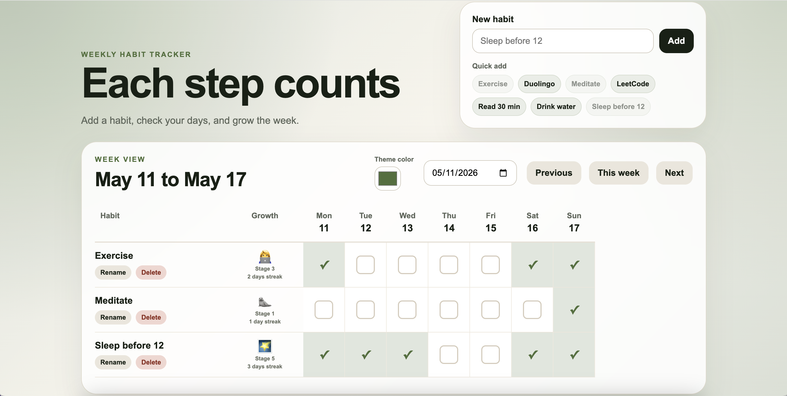
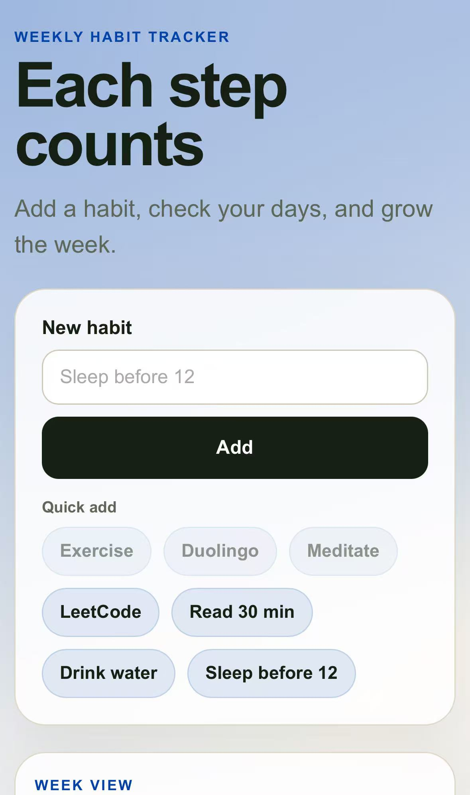
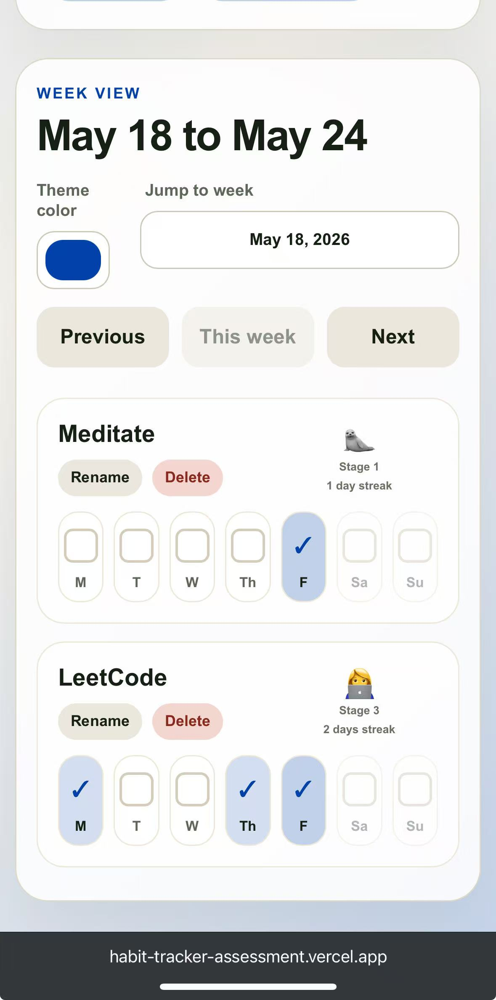

# Habit Tracker

A single page weekly habit tracker built with Vite and React, usable on both computer and phone.

Live app: https://habit-tracker-assessment.vercel.app/

## Preview

### Desktop



### Mobile





## Features

- Add, rename, and delete habits
- Check off habits on a weekly grid
- Navigate to previous weeks, next weeks, or back to this week
- Jump to a week with the date picker
- Highlight today’s column
- Show weekly growth stages and streaks
- Choose a theme color
- Save habits and checkmarks after page reloads
- Mobile layout with individual habit cards

## How to run locally

Make sure Node.js is installed.

From the project folder, run:

```bash
npm install
npm run dev
```

Then open the local URL printed in the terminal, usually:

```bash
http://localhost:5173
```

## Build command

```bash
npm run build
```

## Deployment

This project is deployed on Vercel:

https://habit-tracker-assessment.vercel.app/